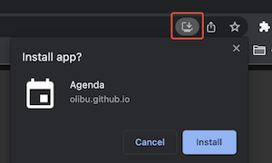
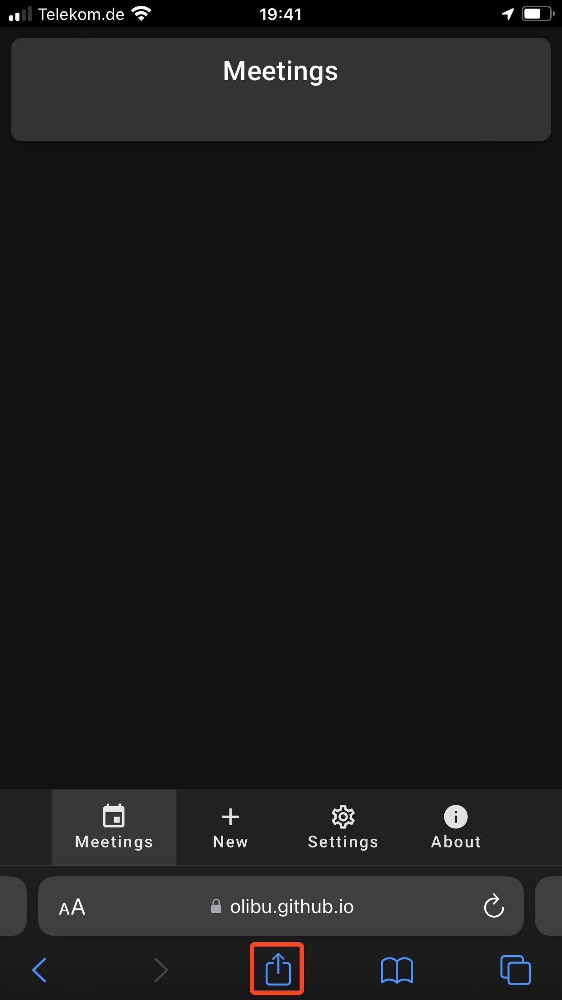
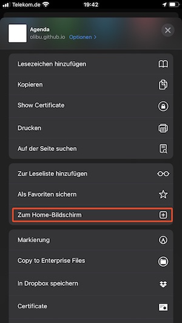
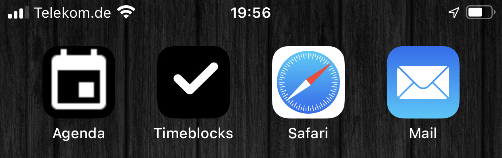
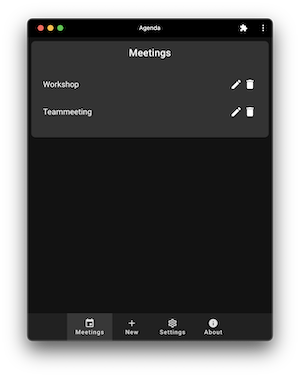
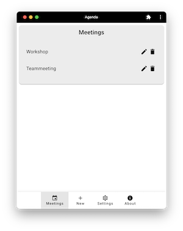
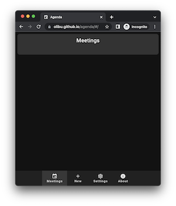
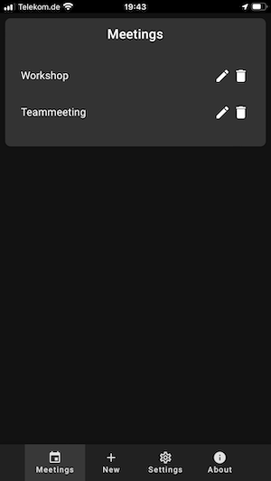
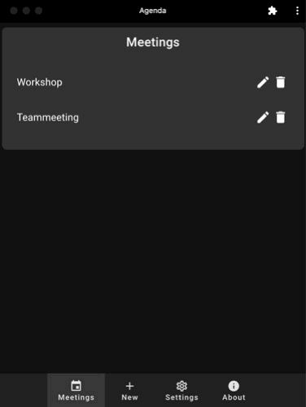
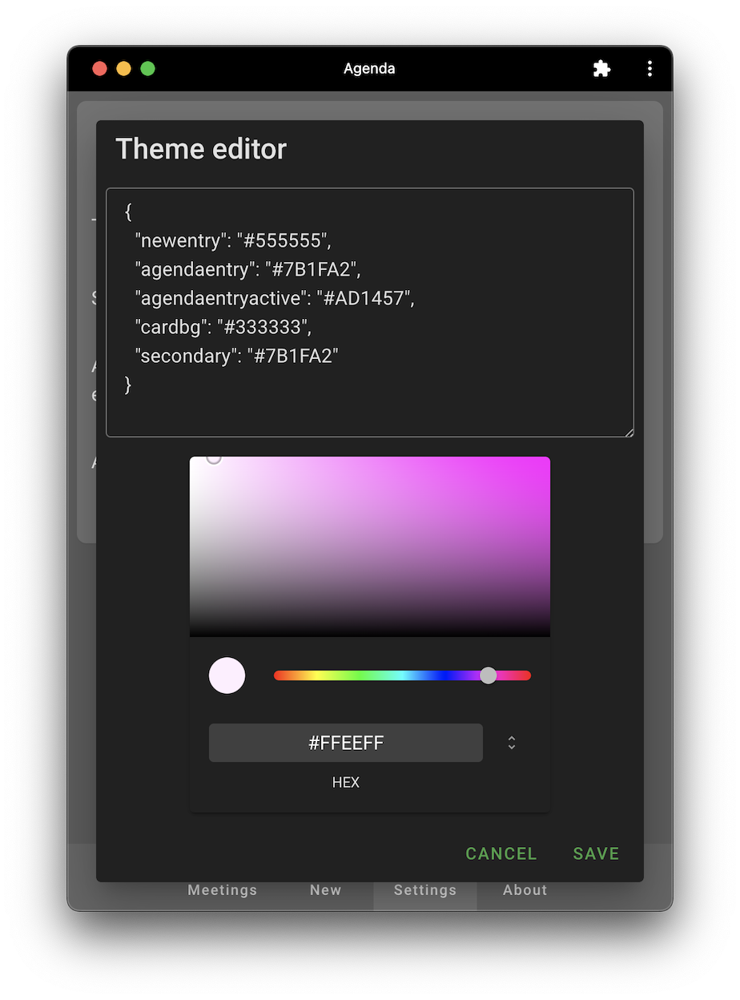

# Agenda User Guide

## Application Start

You can start the application by visiting the following link

https://olibu.github.io/agenda

## Offline Installation in Chrome

In case you want to access the application without internet connection locally from your system you can install it from the address bar of your Chrome browser.

Just visit the link of the application mentioned earlier and click on the installation button in the address bar and on "Install".

Now you can start the application as any other locally installed application.

## Offline Installation on iOS

As any other PWA application you can install this application by opening the URL in Safari.
Then click on the share button of Safari and select "Add to homescreen". 

Now you can start the application from your homescreen even if you do not have an internet connection.

## Main View

Here are some screenshots of the main window on different devices.

## Create a Meeting

You can create a new meeting with "+" from the application bar on the bottom of the application.
An empty meeting will be show, but not already created. You have to press the "ADD MEETING" button to add it to your local store.

You have to set the "Meetingtitle" first. Then you can press tab to move to the first agenda entry.
Set a title and move to the time (in minutes). You can add the agenda entry via <enter> or by the "+" button.
After adding an agenda entry a new placeholder for the next agenda entry will be created and you can continue to add further meetings.

As soon as you change the time value of any agenda entry the meeting duration will be adjusted (right beside the meeting title).

## Modify a Meeting

You can modify a meeting by selecting the "pen" symbol in the meeting view.
Take care not to change you meeting in the "Meeting Mode" as you are not able to save you changes.
If you see the "Save Meeting" button you are in the right mode.

You can add, delete and change the order of agenda entries.
Do not forget to save your changes after your modifications.

## Delete a Meeting

You can delete a meeting by selecting the "trash" symbol in the meeting view.

## Start a Meeting

### Open the Meeting

Open your meeting from the meeting view by clicking on the meeting. Take care not the hit the edit or delete button.
Now you can do the following:
* Modify (add/delete/move) you agenda without any impact on the stored meeting
* You can change titles and times of agenda entries, too
* You can change your meeting relevant settings via the hovering over the settings symbol on the top right corner

### Start the Meeting

Now you can start your meeting via the play icon.
The first agenda entry will be highlighted. Dependent on your meeting settings, the time of the first agenda entry will be adjusted and the end time of the meeting will be calculated and shown in the title.

As soon as the time is near to the end, the color of the count down cycle will change.

In case of "automatic movement" the next agenda entry will be activated. Otherwise the color of the count down cylcle will change to red and the additional time will be added to the end time of the meeting.
Thus you will be able to see when the meeting will end in case your further agenda entries will be finished in time.

If you are finished with an agenda entry earlier, you can move to the next one with the "next" button. In case you fall back to an earlier agenda entry you can click on the "previous" button.

You can move agenda entries at any time. The end time of the meeting will be adjusted accordingly.

In case of new topics you can add them at the bottom of the meeting. You may have to scroll to the end. Don't forget to click on the "+" button or press <enter>

### Change Meeting settings

You can change the meeting related settings directly from within the meetings view by hovering over the "setting" button on the top right.

Details about the options can be found in the "Settings" chapter. All changes are persistent and will be the same for the next meeting.

### Meeting End Time

The time when the meeting will end is added to the title of the meeting.

The rest of time of the current agenda entry and the rest of all not already
finished agenda entries are added to the current time.

The end time of the meeting will be adjusted in case of
* drag&drop of agenda entries
* modifications of the duration of not already finished agenda entries
* adding of new agenda entries
* deletion of not already finished agenda entries

## Settings

The settings view can be opened with the "Settings" button in bottom bar. Meeting relevant settings can be change directly from within the meetings view when hovering over the "Seetings" icon on the top left corner.

### Theme

You can select between the following themes:
* os: Dependent on your system settings, the dark mode or light mode will be selected. This is the default.
* dark: dark mode
* light: light mode
* customDark: customizable dark mode
* customLight: customizable light mode

In case of a customizable theme, the "pen" button will be activated.
You can change the color values of all css attributes. Do not forget to save your changes.

A good reference for material design colors can be found [here](https://m2.material.io/design/color/the-color-system.html)

### Sound on

At the end of an agenda entry and at the end of the meeting a sound will be played.

### Automatic move to next agenda entry

At the end of an agenda entry the next one will be selected automatically. Otherwise the countdown circle will turn into read and a negative time will be shown. The addtional time will be added to the meeting time. Thus the time when the meeting will end is transparent to you. 

### Adjust start time

This option will adjust the first agenda entry based on the current time.

Here is a simple example:
* Topic 1: 30 min
* Topic 2: 30 min

In case you start the meeting at 09:05, the time of Topic 1 will automatically be adjusted by 5 minutes.
Thus the Topic 2 will start at 09:30.

The adjustment will only be done according to the duration of the first agenda entry.

In case your first agenda entry is 5 min and you start the meeting at 9:06, nothing will be adjusted, as no "even" time within the last 5 min can be found. You would have the raise the duration to 10 min before starting the meeting in 
this case.

"Even" times means 30 min steps. 9:00, 9:30 and so on. Thus it would make sense to eather start the meeting in time
or to start you meeting with a "welcome" of 5 to 10 min (especially if you have very short agenda entries). 